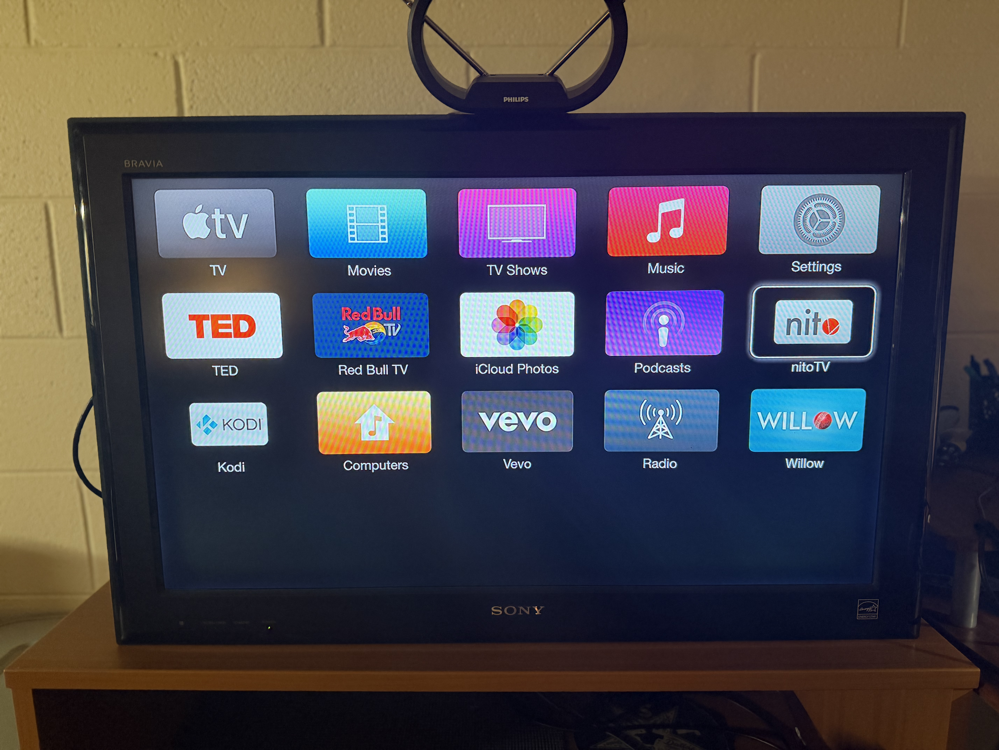
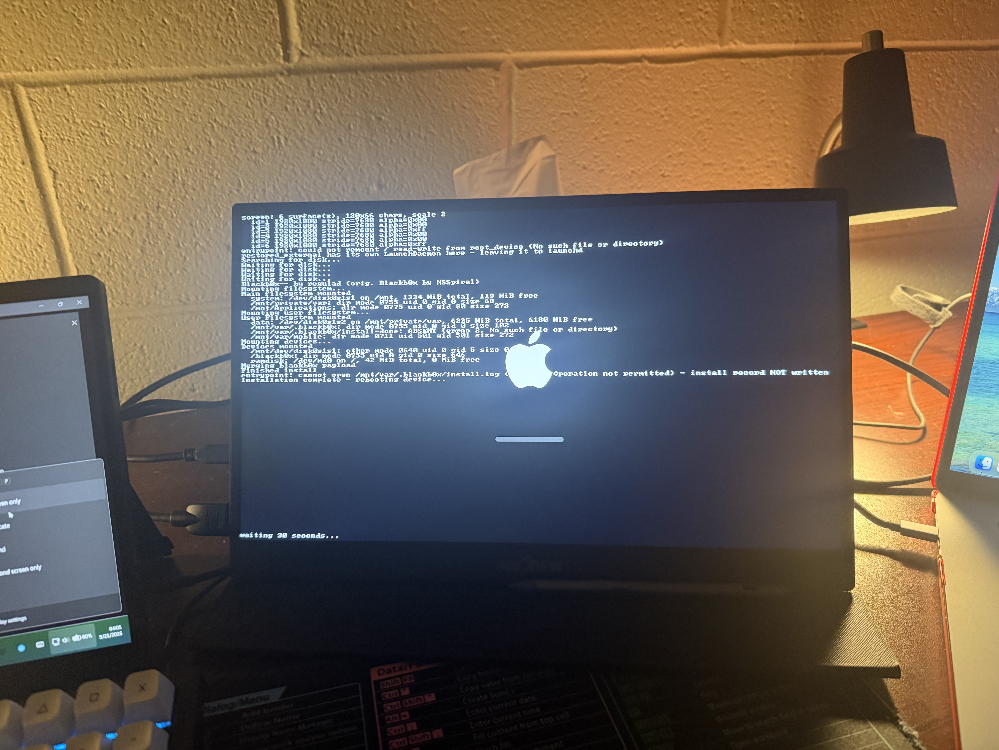

# Blackb0x--

[](https://wakatime.com/badge/github/regulad/Blackb0x--)

Don't eWaste what can still be used! 
 
Jailbreak tool for the 2nd/3rd-gen Apple TV, via the `checkm8`/`SHAtter` DFU-mode boot
exploit. Side-loads Cydia (frontend nitoTV) + Kodi.



Additional features over the original [`blackb0x`](https://github.com/NSSpiral/Blackb0x):

* Works in 2026 with current `apt` repositories
* Restores Appliance support to `lowtide` (the springboard/pineboard equivalent for Apple TV Software), allowing legacy tweaks and apps to appear on the UI
* Injects Debian 13 CAs into Apple TV Software, enabling the entire system to connect to current websites
* `apt-get` configured to use the system SSL handlers (enables TLS 1.2 support, which a vast majority of the internet still supports)
* Logs to screen during install process, making it easier to debug
* GPL compliance (all unlicensed code from Blackb0x was either rewritten or properly vendored and attributed as a submodule)
* Fully declarative payload configuration
* First-class Apple Silicon Mac support (jailbreaking up to macOS 27/Golden Gate; authoring up to macOS 26/Tahoe, see next bullet)
* Opportunistic use of pre-patched binaries built on GHA CD pipeline (eliminates the need to run legacy Xcode through Rosetta 2 nor build huge libraries)

Supported devices:

| device | latest firmware | notes |
|---|---|---|
| AppleTV3,2 (A1469) | tvOS 8.4.3 (formerly Apple TV Software 7.x) | untethered only (`tihmstar`'s `etasonATV`) |
| AppleTV3,1 (A1427) | tvOS 8.4.3 (formerly Apple TV Software 7.x) | untethered only; needs an Arduino running [`synackuk`'s `checkm8-A5`](https://github.com/synackuk/checkm8-a5) to pwn DFU first; `blackb0x` picks up from there |
| AppleTV2,1 (A1378) | tvOS 7.1.2 (formerly Apple TV Software 6.x) | **tethered only** |

**Warning:** AppleTV2,1 support has not been fully validated, please report any issues you encounter to the issues page.

**Tip:** if `blackb0x-pwn` is unreliable over a direct USB-C connection, put a plain
(non-Thunderbolt) USB hub between the Mac and the Apple TV.

Please star this project if it helped you.

## Requirements

Both targets need the Xcode Command Line Tools, plus Homebrew.

### Jailbreaking only

To build and run the jailbreak:

```sh
brew install cmake autoconf automake libtool pkg-config gh
```

`gh` is GitHub's CLI, and it is what lets `blackb0x` fetch a prebuilt firmware
suite instead of baking one. Sign in once with `gh auth login`. Without it you
can still jailbreak, but you have to bake the firmware yourself, which needs
root and everything in the next list.

### Development/authoring

To additionally build the authoring tools (firmware baker, vendored apt, tests):

```sh
brew install git-lfs ldid afsctool dpkg python3 \
             berkeley-db@5 openssl@3 xxhash lz4 xz gettext
```

The baker also needs [Theos](https://theos.dev) for `dm.pl` (`$THEOS`, default
`~/theos`) and **two old Xcodes available locally** to build binaries.

| Xcode | For | Why |
|---|---|---|
| [`Xcode_6.4.dmg`](https://developer.apple.com/services-account/download?path=/Developer_Tools/Xcode_6.4/Xcode_6.4.dmg) | AppleTV3,1 / AppleTV3,2 | `ld64-242.2`, iPhoneOS8.4 SDK |
| [`Xcode_5.1.1.dmg`](https://developer.apple.com/services-account/download?path=/Developer_Tools/xcode_5.1.1/xcode_5.1.1.dmg) | AppleTV2,1 | `ld64-236.4`, iPhoneOS7.1 SDK |

Put both in **`~/Downloads`** and the bake finds them; whole `.dmg`s are fine
and are mounted read-only for the build. Point somewhere else with the
`XCODE_TOOLCHAIN=<dir>` environment variable (an `Xcode.app` bundle, or a bare
extracted toolchain root containing `usr/bin/clang` and `SDKs/iPhoneOS<ver>.sdk`)
or `XCODE_SEARCH_DIR=<dir>` (a different place to look for the same names).
Both are read straight from the environment by `entrypoint/Makefile`, so a CI
job sets one variable and needs nothing else.

Almost everything else is vendored under `third_party/` and built from source.

## Build

```sh
git clone --recurse-submodules https://github.com/regulad/Blackb0x--.git
cd Blackb0x--
cmake -S . -B build
cmake --build build --target jailbreak -j"$(sysctl -n hw.ncpu)"   # jailbreak only: blackb0x and blackb0x-pwn
cmake --build build --target authoring -j"$(sysctl -n hw.ncpu)"   # authoring only: bake-firmware, vendored apt, tests, xpwntool
```

`sysctl -n hw.ncpu` is the macOS equivalent of `nproc`, which does not exist
here.

`bake-firmware` **must run as root**, including `--only bootchain`. It writes into
root-owned files on a mounted ramdisk. Its output in `dist/` is handed back to the
user who invoked `sudo`, so you will not need `sudo` to read or delete your own
build artifacts.

## Jailbreaking

0. **(3,1 only)** Pwn DFU with the Arduino first.
1. **(Optional.)** Nothing to do here if you have `gh` — `blackb0x` fetches the
   firmware it needs on its first run, as described under "Firmware" above (make sure you have logged into `gh`). To bake
   it yourself instead:
   ```sh
   sudo env "PATH=$PATH" "THEOS=$THEOS" ./build/bake-firmware
   ```
   That does every known device/firmware combination, which is far more than you
   need. Narrow it with `--device` and `--build`: when a suite is missing,
   `blackb0x` names the exact device and build it wants — and, if it cannot bake
   one itself, spells out the `bake-firmware` command for it. Existing output is
   skipped unless you pass `--force`.
2. Connect the Apple TV by micro-USB **and** plug in its power cable. If you would like to see the jailbreak live, you'll also need to connect an HDMI cable. You may need to file down the top and bottom of the micro-USB-B male and HDMI male terminations respectively to get them to both fit in the confined space.
4. Run `./build/blackb0x`.
5. Follow the in-terminal instructions to enter DFU mode.
6. Let `blackb0x` attempt `checkm8`. This could take a couple of tries. If it fails, you will need to power-cycle your Apple TV.
7. Once `blackb0x` has succeeded in sending the payload via `checkm8`, you'll see a screen similar to the one below after a minute or two.
   
8. Once the payload finishes injecting the jailbreak to your Apple TV's storage, your Apple TV should go to the "connect to iTunes for recovery" screen. Remove all cords from the Apple TV, then plug back in **only** power and HDMI.
9. After you see the home screen, your Apple TV *should* be Jailbroken.
10. You can now attempt to connect via SSH, user `root`. See `scripts/` for a helper script that pushes your public key to the Apple TV. If you prefer to authenticate with password, the default password is `alpine`.
11. If `ssh` is working, great! Kodi and nitoTV are being installed in the background, they should appear after a few minutes depending on your internet connection. If you do not have an internet connection, `ssh` will still work over `usbmuxd`, but installing Kodi will be deferred until the next boot.

## Development

[`AGENTS.md`](AGENTS.md) has the repo conventions and build details.
[`docs/HISTORY.md`](docs/HISTORY.md) has the full port and debugging history.

## Credits
**[NSSpiral](https://github.com/NSSpiral/Blackb0x)**
* Original Blackb0x

**dora2ios**
* iBSS loader for AppleTV3,1

**tihmstar**
* etasonATV jsc untether
* answering questions about patches

**zzanehip**
* updated CBPatcher (Created by Jonathan Seals)
* updated iBoot32Patcher (Created by iH8sn0w)
* updated xpwntool (Created by planetbeing)

**a1exdandy, synackuk, nyan_satan**
* checkm8-A5

**axi0mx**
* checkm8

**p0sixninja**
* SHAtter

